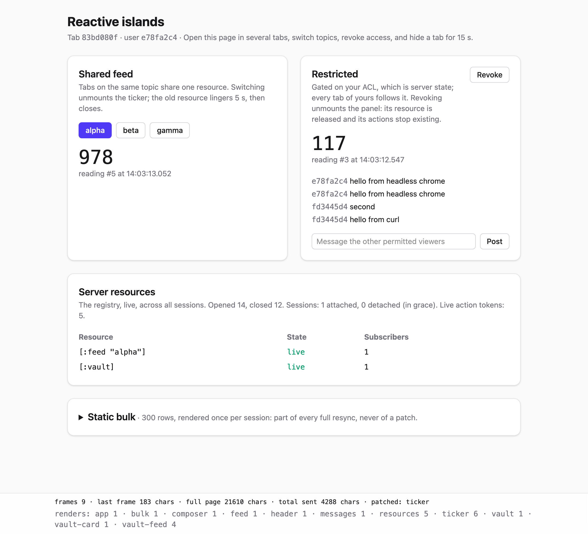

# v2-reactive-islands: a reactive backend for Datastar

> Superseded by [v3](../v3-immediate-islands), which keeps this design without
> Missionary. v3's README covers the design in full, so start there.

Datastar as the frontend, with a Missionary DAG on the server doing "half of
Electric". Each view is split into **islands**. An island re-renders when its own
inputs change and is patched on its own. Stateful resources (proxies, poll loops)
are shared between sessions and reference-counted. They are held exactly as long
as the subtree using them is mounted.

v0 and v1 re-render every session on a timer and send the whole view each tick.
Their resources belong to a single SSE connection. v2 changes all three:

|                  | v0 / v1                                     | v2                                                        |
|------------------|---------------------------------------------|-----------------------------------------------------------|
| When to render   | every session, every tick                   | when an island's inputs change                            |
| What to send     | the whole view                              | the topmost islands that changed                          |
| Resource owner   | the SSE connection                          | a shared registry: refcounted, with a linger              |
| Session lifetime | the SSE connection                          | the tab, with a grace period across reconnects            |
| Authorization    | not covered                                 | scope-based: gated subtrees, capability-style actions     |

## Running

- repl: `clojure -M:repl -m nrepl.cmdline --middleware "[cider.nrepl/cider-middleware]"`,
  then `(user/reload!)`
- main: `clojure -M -m example.main`
- tests: `clojure -M:test`

Open <http://localhost:8080> in two or three tabs.



## Things to try

The footer shows each frame's size next to the full page's size, which islands
were patched, and how often each island has rendered. The **Server resources**
card shows the registry live, across every session.

1. **Share.** With two tabs on `alpha`, `[:feed "alpha"]` has two subscribers but
   was opened once. A typical frame is about 180 chars against a 21 KB page.
   `bulk` rendered once and never appears in a patch.
2. **Switch.** Pick `beta`. The `alpha` ticker unmounts, its resource goes
   `lingering`, and it closes 5 s later. Switch back within 5 s and it is reused
   instead of reopened.
3. **Revoke.** The panel unmounts and `[:vault]` lingers and then closes. The
   live action token count drops, because the panel's actions no longer exist.
   To see that, copy the Post button's `/act/<token>` URL from the element
   inspector before revoking. Afterwards, `curl -X POST localhost:8080/act/<token>`
   gets a 404. While the token was live, it would have got a 403 without your
   cookie.
4. **Hide a tab.** Switch to another browser tab. Datastar closes a hidden tab's
   stream, so the session shows as detached. Come back within 15 s and the island
   tree is resent from cache (`patched: app`); nothing reopens. Stay away longer
   and the session closes. Returning then starts a fresh session.
5. **Post.** Type a message and press Enter. It appears in every tab that may
   see the vault. The input is cleared by the action's JSON response.

## Design

### Islands (`example.island`)

An island is a Missionary continuous flow of `Frame`s for one element id:

```clojure
(island "feed"
  {:inputs {:topic (m/watch !topic)}                          ; continuous flows
   :slots  {:ticker (island/switch-by (m/watch !topic) ticker)}} ; child islands
  (fn [{:keys [topic]}]                                       ; plain hiccup
    [:div [:h2 topic] (slot :ticker)]))
```

- **Render only on own change.** `render` receives the latest values of its
  `:inputs`. Child islands are holes (`slot`), filled in when HTML is emitted, so
  a child's change never re-renders its parent. Missionary's `latest` and
  `cp` skip inputs that are `=` to their previous value, so an equal update
  renders nothing and sends nothing. The price is an `=` per change.
- **Compile once, emit by appending.** A render is serialized once into a
  `Template`: string parts plus holes. Emitting a page appends cached strings and
  re-renders nothing. An unchanged island costs nothing per frame.
- **Patch the topmost change.** `patches` walks the previous and the next frame
  tree top-down and compares templates by identity. It sends each island whose own
  template changed, children included, and never also sends its descendants. SSE
  is one ordered stream, so the server knows exactly what the client shows. The
  whole root is resent only when that is unknown, i.e. after a reconnect. Each
  patch is a Datastar `patch-elements` morph, targeted by id.
- **Contain failures.** A render that throws becomes an error box in its island.
  It never fails the session's root flow.

### Resources (`example.resource`)

This registry is where "neither torn down while in use, nor kept when unused"
is enforced:

- One physical resource per key, opened by the first subscriber.
- Subscribing is a flow. `m/observe` acquires on mount and releases when the
  process is cancelled. Nothing calls `release!` by hand. Unmounting a subtree,
  whether by a switch, a gate or a closed session, cancels its processes, and
  that is what releases the subscriptions.
- After the last subscriber leaves, the resource lingers (`linger-ms`) before
  closing. This absorbs churn from switching back and forth, re-granting, and
  navigation.
- Values are published through an atom and read with `m/watch`. `m/observe`'s
  callback throws if called while a previous value is still pending, so it
  mustn't be fed from several threads. `m/watch` can be written from any thread
  and samples the latest value.
- The simulated resource (`ticker`) is a loop in a Quiescent task. It is created
  under `q/compel` because it belongs to the registry, not to whichever session
  subscribed first. Otherwise it would die with that session.

In the platform, `subscribe` corresponds to `mh/subscribe` (already an
`m/observe` over `foreign-proxy-async`), and `ticker` to a proxy or `hooks/poll`.

### Sessions (`example.session`)

- **One session per tab, not per connection.** `GET /` creates the session and
  server-side renders the page from its first frame. The tab's
  `@get('/stream?tab=…')` then attaches. The session records that the client
  shows the SSR'd frame, so the first attach sends only what has changed since.
- **Reconnects are routine.** Datastar closes a hidden tab's `@get` stream
  (`openWhenHidden` defaults to false for GET) and retries on errors. A detached
  session keeps its DAG, and so its resources, for `grace-ms`. Reattaching resyncs
  the root from cache. After the grace period the root is cancelled, and
  everything under it is released through the normal process lifecycle.
- **One pump per session.** A virtual thread owns all of the session's mutable
  state (connection, last-sent frame, stats) and consumes a mailbox. A flow
  notification only posts `:dirty` to it. Sampling, and so rendering, happens on
  the pump, never on the thread that changed an input. A shared resource's loop
  never renders on anyone's behalf.
- **Backpressure for free.** A continuous flow is sampled only when the pump is
  ready. A slow client gets fewer, later frames, never a backlog. `frame-ms`
  coalesces bursts; the latest state wins.
- **Heartbeats.** A dead connection is only noticed on write. A quiet session
  writes a heartbeat every `heartbeat-ms`.

### Authorization (`example.action`, `island/gate`)

- **Reads are scope-based.** `(island/gate allowed then else)` mounts one branch
  or the other, and switching cancels the other branch. Markup for a subtree the
  user may not see is never produced. That is stronger than Electric, which
  ships the gated code in the bundle and merely doesn't mount it.
- **Writes are capabilities.** An action is an island input like any other.
  Mounting it mints an unguessable token bound to the user's cookie and renders
  `@post('/act/<token>')`. Unmounting revokes it. A POST can only reach closures
  currently mounted for that user, the same guarantee Electric's protocol gives.
  The authority check happened at mount time, and the closure carries it.
- **Arguments are untrusted.** Signals arrive from the client and must be
  validated, as `e/client` → `e/server` values always had to be. See
  `state/post-message!`.
- **Commands and queries.** A POST runs the command and answers 204, or JSON to
  patch signals. The view updates arrive over the stream.
- **The race.** A request can race a revocation and still run a moment after its
  island unmounted. For writes that matter, check again in the write path (in
  the platform, in the Rama transaction). Electric has the same window.

## Limits and open questions

- **No compiler.** Electric builds the DAG from ordinary code; here it is
  explicit, and you draw the island boundaries. A flow built inside a switch
  body (`switch-by`'s `f`) is rebuilt on every switch. That is harmless for
  resources, thanks to the registry and the linger, but anything held in the
  island, such as its render count, starts over.
- **No keyed lists.** A list is one island, re-rendered whole. The next step
  would be keyed child islands, plus Datastar's `append`/`remove` patch modes
  for growth, e.g. streaming tokens.
- **Morphs and inputs.** An island containing an `<input>` should not depend on
  data that ticks, or morphs will fight the user's typing. `composer` is split
  out for that reason. Client-local UI state belongs in Datastar signals.
- **Single node.** Sessions and action tokens live in memory. With several web
  nodes, `/stream` and `/act` need sticky routing to the node that holds the
  session.
- **HTTP/2.** Every tab holds one SSE connection, and browsers allow about six
  HTTP/1.1 connections per origin. Beyond local testing, serve over HTTP/2.
- **Consistency across resources.** Each resource updates independently. A frame
  is glitch-free within the DAG but not across data sources.
- **Compression** is not enabled here. The SDK has gzip write profiles. With
  targeted patches it matters less than with full-page re-renders.
