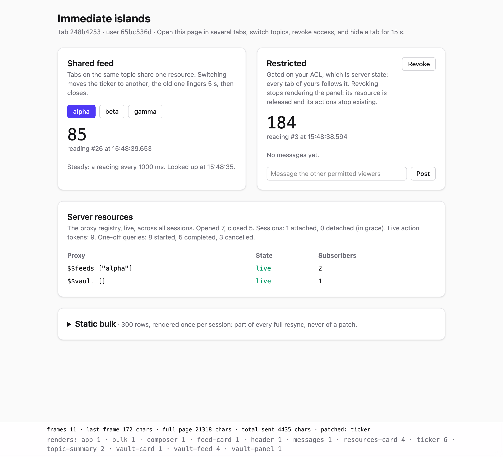

# v3-immediate-islands: islands as functions, no reactive library

The same demo as [v2](../v2-reactive-islands), with v2's Missionary graph
replaced by immediate-mode rendering, as React does it. An island is a function
defined with `defisland` that returns hiccup. It reads state through hooks, and
it renders again only when its arguments or something it read have changed.
Reads from the database go through `<-` (a proxy) and `?` (a one-off task),
named after the platform's Electric helpers. A proxy or task is held by the
island that asks for it, for as long as its renders keep asking. An island that
is no longer rendered is unmounted, and what it held is released.

Everything outside the island layer is v2's: the shared resource registry with
its linger, tab sessions with a grace period, action tokens, and topmost-change
patching. The question this version answers is whether we need a reactive graph
library to get v2's guarantees, or whether ordinary functions and a small
runtime will do.

## Running

- repl: `clojure -M:repl -m nrepl.cmdline --middleware "[cider.nrepl/cider-middleware]"`,
  then `(user/reload!)`
- main: `clojure -M -m example.main`
- tests: `clojure -M:test`

Open <http://localhost:8080> in two or three tabs.



## Things to try

The footer shows each frame's size next to the full page's size, which islands
were patched, and how often each mounted island has rendered.

1. **Share.** With two tabs on `alpha`, the proxy `$$feeds ["alpha"]` has two
   subscribers but was opened once. A typical frame is about 175 chars against a
   21 KB page.
2. **Switch.** Pick `beta`. `feed-card` renders with its new local state and
   gives `ticker` and `topic-summary` a new topic. `ticker` asks for the new proxy
   instead of the old one, so the old one lingers for 5 s and then closes. Switch
   back within 5 s and it is reused.
3. **Query once.** `topic-summary` reads with `?`, a 700 ms simulated query. The
   **Server resources** card counts the runs: ticker readings don't rerun it,
   only a new topic does. Click through the topics quickly and the runs you
   overtake are cancelled.
4. **Revoke.** `vault-card` stops rendering `vault-panel`, so the panel and its
   children unmount: `$$vault []` lingers and closes, and the live action token
   count drops. A POST to one of the panel's old `/act/<token>` URLs gets a 404,
   and so does one made after granting again: a remount mints new tokens.
5. **Post.** Each message is a keyed island (`message-<n>`). A new message renders
   `messages` and the new row once. The rows already shown are reused, not
   re-rendered.
6. **Hide a tab.** Datastar closes a hidden tab's stream. Come back within 15 s
   and the page is resent from cache (`patched: app`); nothing reopens.

## Writing islands

```clojure
(defisland vault-card
  [uid]
  (let [allowed (use-watch state/!acl #(state/allowed? % uid :vault))
        toggle  (use-action :toggle (fn [_] (state/toggle! uid :vault) nil))]
    [:section {:class card}
     [:button {:data-on:click toggle} (if allowed "Revoke" "Grant")]
     (if allowed
       (vault-panel uid)
       (no-access))]))
```

- **An island is a function of its arguments.** Calling one inside another
  island's hiccup places it there; the runtime decides whether it renders. It
  renders when it is new, when its arguments changed (`=`), or when something it
  read changed. Otherwise its last output is reused.
- **The id is the island's name.** It is set on the root element the island
  returns, and it is what Datastar patches. Ids must be unique on the page. For
  several instances, give a `:key` fn of the arguments: `(defisland message {:key
  :n} [msg] ...)` gives `message-17`.
- **Hooks take a key, not a call order.** Each hook names what it is, so
  conditionals and loops around hooks are fine:
  - `(use-watch ref)` or `(use-watch ref select)` reads an atom (anything
    watchable). The island renders again when the selected value changes, so
    `#(state/allowed? % uid :vault)` ignores every other user's ACL change.
  - `(use-state :k init)` returns `[value set-value!]`: island-local state, kept
    while the island is mounted. `set-value!` can be called from an action.
  - `(use-action :k handler)` returns a Datastar `@post(...)` expression, bound
    to a token that exists while the island renders it.
  - `(use-hold :k acquire)` is the primitive under `use-action`, `<-` and `?`:
    something acquired once and released when the island stops asking for it.
- **Database reads use the platform's two helpers** (`example.hooks`):
  - `(<- pstate path)` streams `path` through a proxy shared by every session.
    Another `pstate` or `path` releases the old proxy, which lingers, and holds
    the new one. `{:init x}` stands in for the value until the first one arrives.
  - `(? f & args)` runs a function returning a Quiescent task, once per distinct
    `f` and `args`. New arguments cancel a run in flight and start another. A
    failure throws in the render, so `try` handles it as in Electric. Pass a
    named `f`: it is part of the key.
  - Both return `hooks/pending` until their first value. The Electric versions
    throw `Pending` instead.
- **The gate is `if`.** A branch that isn't rendered holds nothing and exposes
  no actions. That is Electric's scope-based access control in ordinary code.

The same rules as React apply, and the same mistakes are possible:

- A value read without a hook (a bare `@atom`) is not tracked, so the island
  will not re-render when it changes.
- Passing a fresh closure or collection as an argument makes it unequal on every
  render, so the child re-renders every time. Pass data.
- The work is slicing islands at the right size: an island is the unit that
  re-renders and is resent. In the demo, `composer` holds the text input and reads
  nothing that ticks, so typing is never morphed away.

## How it works

### Runtime (`example.runtime`)

Each session has one runtime, used only by the session's pump thread.

- **Reconciling.** A frame starts from the islands whose reads changed. It
  renders them and visits their ancestors on the way down. Every other subtree
  is reused as it is, without being visited. An island that renders compiles its
  hiccup once into a template: strings, plus holes where child islands go.
  Output equal to the previous render keeps the previous template, so nothing is
  sent.
- **Unmounting.** When an island renders without a child it placed before, that
  child and everything under it unmount. Their holds are released, their watches
  removed and their action tokens revoked. Nothing is released by hand.
- **Watching.** A session watches each ref once, however many islands read it.
  A watch callback only posts the ref to the session's mailbox. On the pump, each
  island that read the ref re-runs its selector, and renders only if the selected
  value changed.
- **Holding.** A hold is acquired on first use and released after the first
  render that doesn't use it, or on unmount. A failed render releases what it
  didn't reach before throwing; the registry's linger absorbs that.
- **Failures.** A render that throws renders an error box in its place, without
  children.

### Unchanged from v2

`example.resource`, `example.session`, `example.action` and `example.core` keep
v2's design. See [v2's README](../v2-reactive-islands/README.md) for the
rationale. The differences:

- `resource/subscribe` (a Missionary flow) became `<-`, keyed by PState and path.
- `action/action` (a flow) became the `use-action` hook.
- The session renders whenever something changed, even while no client is
  attached. What islands hold, and the actions they expose, therefore always
  follow the current state; v2 deferred that until the next client attached. A
  frame is still only sent to an attached client.
- Closing a session unmounts every island directly. v2 had to drain the
  cancelled flow first.

## v2 and v3 compared

Measured in the REPL on the demo page, for one ticker reading: render the frame,
diff it, and serialize the patch. JDK 27, warmed up, 50,000 frames:

|                   | v2 (Missionary) | v3 (runtime) |
|-------------------|-----------------|--------------|
| Time per frame    | ~8.9 µs         | 8–9 µs       |
| Allocated per frame | ~8.1 KB       | ~16.7 KB     |
| Page code (`page.clj`) | 318 lines  | 286 lines, with keyed message rows and the `?` card added |
| Island engine     | 192 lines + Missionary | 506 lines (`island` + `runtime`), no dependency |

- **Cost.** Equal in time. v3 allocates about twice as much per frame, all of it
  short-lived. At 1,000 tabs each receiving 2.5 frames per second, that is about
  40 MB/s of young-generation garbage, which a generational collector handles
  easily. The extra comes from bookkeeping maps rebuilt per frame, and could be
  reduced if it ever mattered.
- **Page code.** v3 reads as ordinary Clojure, as the vault card above shows. In v2
  the same card needed explicit `:inputs`, `:slots` and `island/gate`.
- **Debugging.** A v3 render is a function call: stack traces are plain, and an
  island can be rendered in a test harness with no flows involved.
- **What v3 gives up.** Missionary's operators, such as time-based ones, and its
  supervision semantics. Scoped lifetimes and coalescing come from v3's runtime
  and session pump instead, and are covered by the tests.

## Limits and open questions

- **Untracked reads go stale**, as described under "Writing islands".
- **A shared derived value is computed per island.** Two islands that select the
  same expensive derivation each run it, and two sessions running the same `?`
  each run it too, as in Electric. Share it through the proxy registry instead:
  a registry entry can be a derived computation.
- **Lists are keyed islands.** A list's parent re-renders when the list changes,
  and is resent with its cached rows. Datastar's `append`/`remove` patch modes
  could make growth cheaper, e.g. for streaming tokens.
- **Ids are global.** An id used twice on the page is caught when both are in one
  island's output, or when both are visited in the same frame. Otherwise it is
  not.
- **Consistency within a frame.** Islands read refs as they render, so a ref that
  changes mid-frame can be seen at two values; the next frame corrects it. v2 had
  the same limit across separate sources.
- **Single node, HTTP/2, compression:** as in v2.
